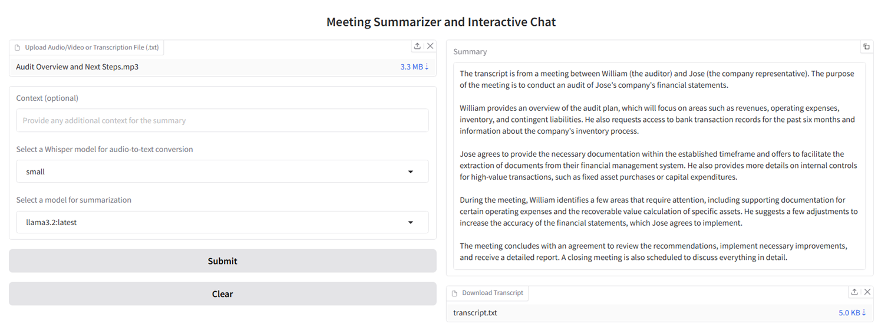
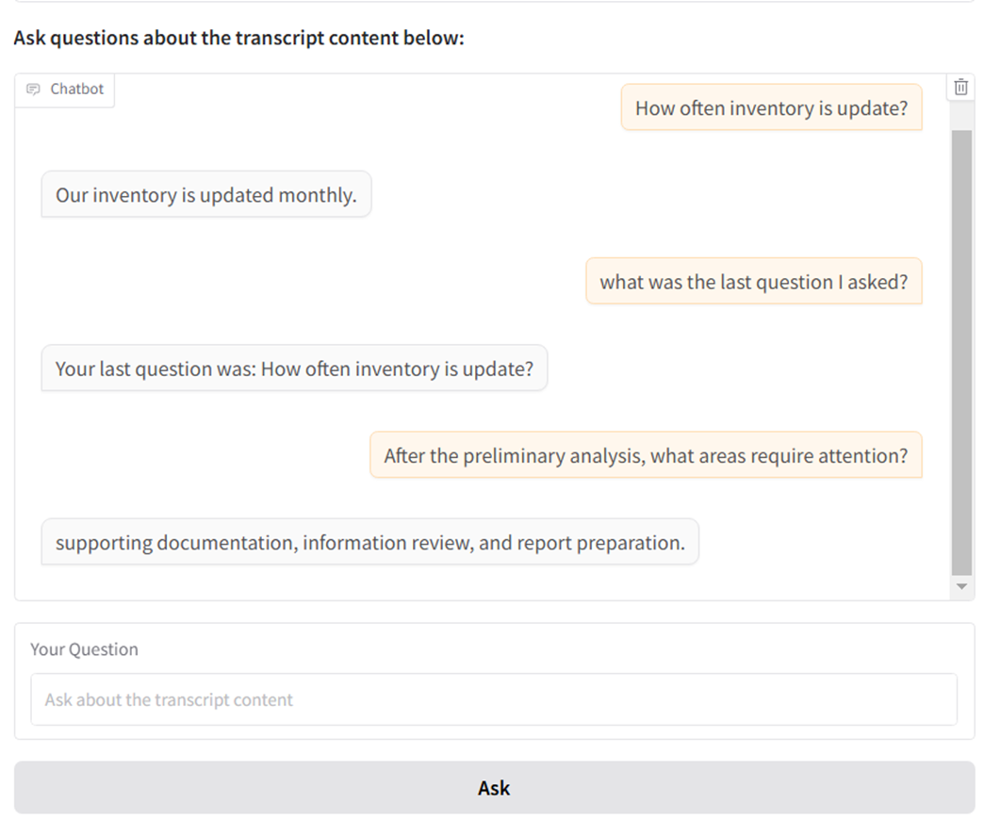

# AI-Auditing Meeting Summarizer and Interactive Chat

An AI-driven tool that processes meeting audio, video, and text files to provide concise, accurate summaries and enables interactive chat with the transcript. This tool leverages whisper.cpp for efficient audio-to-text conversion and models from the Ollama server for summarization and chat capabilities. The application also includes a user-friendly Gradio web interface.

## Table of Contents

- [Introduction](#introduction)
- [Features](#features)
- [Installation](#installation)
- [Usage](#usage)
- [Project Structure](#project-structure)
- [Dependencies](#dependencies)
- [Configuration](#configuration)
- [Running the Application](#running-the-application)
- [Customization](#customization)
- [Examples](#examples)
- [Troubleshooting](#troubleshooting)
- [Contributors](#contributors)
- [License](#license)
- [Acknowledgements](#acknowledgements)

---

## Introduction

The **AI-Powered Meeting Assistant** is designed to transcribe, summarize, and interactively chat with meeting content. It allows users to upload meeting audios, video recordings, or text transcripts and provides options for summarization and interactive Q&A with the transcript. The chat feature retains context, enabling a continuous conversation and recall of previous interactions within the session. Using **whisper.cpp** for audio-to-text conversion and **Ollama** models for summarization and chat, this tool extracts key points, decisions, and action items in an easily digestible format. The application is powered by **Gradio** for a seamless user experience.

## Features

- **Audio/Video-to-Text Conversion**: Uses `whisper.cpp` to transform audio files into text with support for multiple models (e.g., base, small, medium, large-V3).
- **Text Summarization**: Utilizes models from the Ollama server to provide concise summaries.
- **Interactive Chat**: Engage in a Q&A session with the transcribed meeting content, with memory of prior questions and answers for a continuous conversation.
- **Multiple Model Support**: Easily switch between different Whisper and Ollama models.
- **Translation**: Automatically detects and transcribe audio and videos files to English and Brazilian Portuguese if necessary, and also allows the user download the transcriptions as text files.
- **Gradio Interface**: Offers a web-based interface to upload audio, view summaries, and download transcripts.

## Installation

1. **Pre-Installation**: Ensure you have the **Ollama server** running locally or on a remote server. Follow the Ollama documentation to set up the server and download a model.
   ```bash
   # Example: Running Llama 3.2 on Ollama
   ollama run llama3.2
   ```	

2. **Clone the Repository**: Clone the repository from GitHub:
   ```bash
   git clone https://github.com/WilliamMassalino/AI-Auditing-Meeting-Summarizer.git
   cd AI-Auditing-Meeting-Summarizer
   ```

3. **Run the Setup Script**:
   ```bash
   chmod +x run_meeting_summarizer.sh
   ./run_meeting_summarizer.sh
   ```
This script will:

* Create and activate a Python virtual environment.
* Install dependencies including requests, gradio, and ffmpeg.
* Build whisper.cpp and download the necessary Whisper model.
* Launch the Gradio interface.

## Usage

### Uploading an Audio File

1. **Upload**: Click on the upload area to select an audio/video file in formats like `.wav`, `mp3`, `mp4`, and also `.txt`.
2. **Context (Optional)**: Provide context to help refine the summarization (e.g., "Meeting about Q4 Financials").
3. **Model Selection**: Choose a Whisper model for transcription and an Ollama model for summarization (For this project I used `small` and ``medium` models).

### Interacting with the Chat Feature

* After transcription, access the **Chat** feature to ask questions about the meeting content. The assistant retains memory of prior questions and responses within the session, allowing for follow-up questions based on previous answers.

### Viewing Results

- The Gradio interface will display the generated transcript and summary.
- Download the full transcript as a text file if needed.

## Project Structure

The project structure is as follows:

```plaintext
AI-Powered-Meeting-Assistant/
│
├── backend/
│   ├── __init__.py
│   ├── audio_processing.py      # Converts audio to text
│   ├── model_services.py        # Manages AI model services
│   ├── summarizer.py            # Summarizes text content
│   ├── populate_database.py     # Populates the Chroma database
│   └── rag_app/                 # Responsible for Retrieval-Augmented Generation (RAG) chat functionality
│       ├── get_chroma_db.py     # Retrieves relevant documents for chat
│       ├── get_embedding_function.py # Embedding function for document matching
│       └── query_rag.py         # Handles interactive query processing
│
├── frontend/
│   ├── __init__.py
│   └── app.py                   # Web interface logic using Gradio
│
├── whisper.cpp                  # C++ code for Whisper models
├── main.py                      # Main entry point
├── requirements.txt             # Python dependencies
├── run_app.sh                   # Runs the Gradio app
├── run_meeting_summarizer.sh    # Full setup and run script
├── .gitignore                   # Git ignored files
└── LICENSE                      # Project license

```
## Dependencies

- **Python 3.x**
- **FFmpeg**: For audio processing
- **whisper.cpp**: For audio-to-text conversion
- **Ollama server**: For text summarization
- **Gradio**: For the frontend interface
- **Requests**: To make API calls to the Ollama server

## Configuration

- **Audio Processing**: Ensure `ffmpeg` is installed for handling various audio formats.
- **Model Configuration**: Modify model settings in `run_meeting_summarizer.sh` or directly within Python files.

## Running the Application

### Using Shell Scripts
- When running the application for the first time, run `./run_meeting_summarizer.sh` for a full setup.

This script will:

- Create and activate a Python virtual environment.
- Install necessary Python packages like requests and gradio.
- Check if FFmpeg is installed and install it if missing.
- Clone and build whisper.cpp.
- Download the required Whisper model (default: small).
- Run the main.py script, which will start the Gradio interface for the application.

After the initial setup, you can start the app using `./run_app.sh` 

### Manual Execution

    ```bash
    source .venv/bin/activate
    python main.py
    ```
- The Gradio URL will appear in the console. Visit it in your browser to use the app.

## Customization

- **Changing Whisper Models**: Modify `WHISPER_MODEL` in `run_meeting_summarizer.sh` to change the model:
  ```bash
  WHISPER_MODEL="medium"
  ```	
**Downloading Additional Models:**
    ```bash
    cd whisper.cpp
    ./models/download-ggml-model.sh base  # Download base model
    ./models/download-ggml-model.sh large # Download large model
    ```
## Examples

In this example, I used an audio(created by AI) about an Initial Audit Meeting (The same audio example can be found in the `Example` folder) and after the transcription, I used the chat feature to ask questions about the meeting content.:
**Notice: I asked questions about the meeting content, and the chat feature retained context, allowing for follow-up questions based on previous answers.**






## Troubleshooting

- **Virtual Environment Issues**: Ensure the virtual environment is activated.
- **Model Errors**: Verify model paths and server connections.
- **Audio Processing**: Check `ffmpeg` installation if audio conversion fails.

## Contributors

- **William Massalino** - Project Lead & Developer
- Contributions are welcome! Open issues or submit pull requests for improvements.

## License

This project is licensed under the MIT License. See the [LICENSE](LICENSE) file for more information.

## Acknowledgements

- **whisper.cpp** by Georgi Gerganov for audio-to-text conversion.
- **Gradio** for the interactive web interface.
- **Ollama** for the large language models used in summarization.
